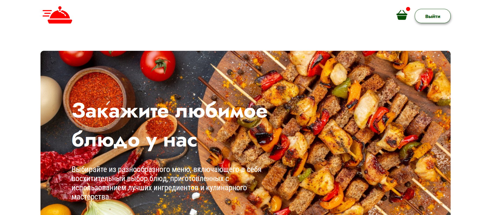
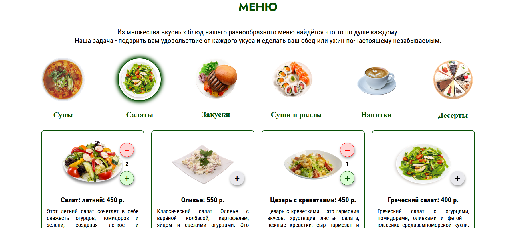
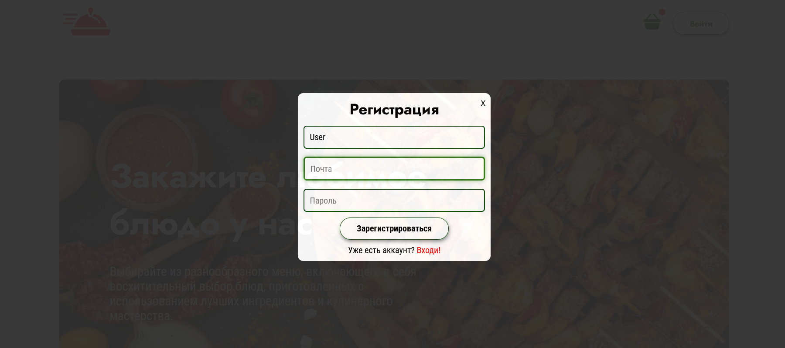
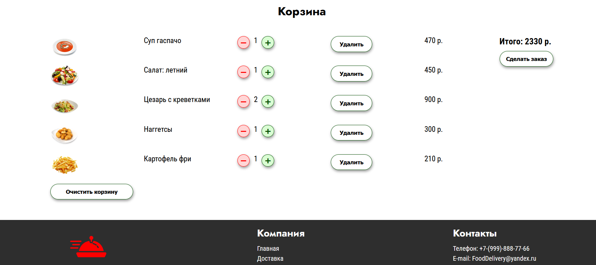

# FoodDelivery

## Описание

FoodDelivery - это веб-приложение для доставки еды.  
Пользовательская часть написана на React с применением Redux Toolkit в качестве стейт менеджера.  
Серверная логика реализована на Node.js, Express и MongoDB.

На данный момент реализованный функционал включает:

- Главную страницу, выводящую каталог товаров с бэкенда;
- Фильтрацию товаров по категориям;
- Страницу корзины товаров с возможностью редактирования (добавление / удаление товаров);
- Регистрацию и авторизацию пользователя.

---

## Стек (MERN)

- **Frontend**: React, Redux Toolkit, TypeScript, CSS Modules;
- **Backend**: Node.js, Express;
- **База данных**: MongoDB.

---

## Демонстрация интерфейса

### Главная страница
Навигационная панель и баннер — первое, что видит пользователь при входе:
 

 
### Каталог товаров
Карточки блюд с возможностью фильтрации по категориям:
 

 
### Регистрация
Форма регистрации с валидацией:
 


### Корзина
Корзина с добавленными товарами и возможностью оформить заказ:  
 

 

---

## Запуск

1. Клонируйте репозиторий и перейдите в папку проекта:

```bash
git clone https://github.com/Pavel-on-GH/food-delivery.git
cd your-mern-project
Запустите backend:
```

2. Настройте переменные окружения:

Приложение использует файл `.env`, которого нет в репозитории. Вместо него предоставляется шаблон `.env.example`.
Скопируйте файл-шаблон:

```bash
cp .env.example .env
```

Откройте .env и заполните свои значения:

```bash
MONGO_URI=<ввести‑свой‑MONGO_URI>
JWT_SECRET=<ввести‑свой‑JWT_SECRET>
```

3. Запустите backend

```bash
cd backend
npm install
npm run server
```

4. Запустите frontend

В новом терминале запустите frontend:

```bash
cd frontend
npm install
npm run dev
```

- Backend будет работать на http://localhost:4000
- Frontend будет работать на http://localhost:5173
